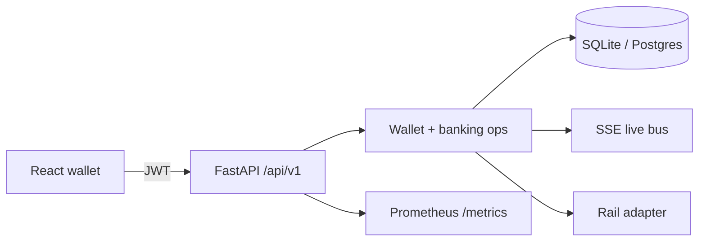

<p align="center">
  
  
  
  
  <a href="https://paykotha.onrender.com"></a>
</p>

<h1 align="center">PayKotha</h1>

<p align="center"><i>Money that finds its words.</i> · <i>টাকারও আছে নিজস্ব কথা।</i></p>

<p align="center">
  A sandbox mobile-finance wallet — the kind of app people use every day for send money,<br/>
  cash out, bills, and QR pay — built to show how real MFS / core-banking systems are put together.
</p>

<p align="center">
  <b>Live app:</b> <a href="https://paykotha.onrender.com">https://paykotha.onrender.com</a><br/>
  Alice <code>01711111111</code> / <code>1234</code>
  · Bob <code>01722222222</code> / <code>5678</code>
</p>

> This is a learning / portfolio system, not a licensed payment institution.
> It does not connect to live bKash or Bangladesh Bank rails.

---

## Why this exists

Most wallet tutorials stop at “transfer money in a database.”  
PayKotha goes further: double-entry posting, KYC limits, OTP on large amounts, live balance updates, and a small ops desk for settlement and reversals — so the project reads like a real platform sketch, not a toy form.

The UI follows a mobile wallet shell (home, history, scan, inbox, me) with a dictionary-card brand splash: **PayKotha — money that finds its words.**

---

## Features

### Customer wallet
- Send money, cash in / cash out  
- Mobile recharge, bill pay, merchant / QR pay  
- Add money from bank, bank transfer out  
- Request money (pay / cancel in Inbox)  
- Savings pot (deposit / withdraw)  
- Donations  
- Favorites, notifications, Excel statement export  

### Me / account hub
- Profile, LIVE status, KYC badges  
- Daily limit meter and month in / out / fees  
- KYC upgrade (L0 → L1 → L2)  
- PIN change, favorites CRUD, limits & fee sheet  
- Shortcuts into savings, bank, requests, ops (admins)  

### History / Inbox / Scan
- Statement search + filters + expandable txn detail  
- Inbox Action vs Alerts (pay requests, mark read)  
- Receive code / pay merchant modes  

### Banking-style controls
| Control | What it does |
|--------|----------------|
| Double-entry ledger | Debit / credit lines (`WALLET`, `FEE_INCOME`) |
| Idempotency keys | Stops duplicate posts |
| KYC tiers | `L0_BASIC` / `L1_NID` / `L2_FULL` with caps |
| Step-up OTP | Required above ৳5,000 (configurable) |
| PIN lockout | Failed attempts → timed lock + audit |
| JWT + refresh | Short access tokens |
| Payment rails | `sandbox` / `mock_npsb` adapters |
| Maker-checker | Reversals need a second admin |
| EOD settlement | Batch fee volume + rail handoff |
| Reconcile + audit | Liability snapshot and trail |
| Live SSE | Balance / inbox updates without refresh |
| Metrics | Prometheus `/metrics` |

---

## Stack

- **API:** FastAPI, SQLAlchemy, Pydantic, JWT  
- **UI:** React, TypeScript, Vite, Anime.js  
- **Data:** SQLite (simple / Render free) or Postgres + Redis (Docker Compose)  
- **Ship:** Multi-stage Docker (builds `web/dist` into the API image) · `render.yaml` free Blueprint  

---

## Try it online

1. Open [paykotha.onrender.com](https://paykotha.onrender.com)  
2. Log in as Alice or Bob (table below)  
3. Open two browsers — send money and watch the other balance update live  

Free Render sleeps after idle; first open can take ~30–60 seconds.

| Role | Phone | PIN |
|------|-------|-----|
| Alice (customer) | 01711111111 | 1234 |
| Bob (customer) | 01722222222 | 5678 |
| Ops Maker | 01999999991 | 111111 |
| Ops Checker | 01999999992 | 222222 |
| Bootstrap admin | 01999999999 | 999999 |

---

## Run locally

```bash
git clone https://github.com/Hasin-99/PayKotha.git
cd PayKotha

python3 -m venv .venv
source .venv/bin/activate          # Windows: .venv\Scripts\activate
pip install -r requirements.txt

cd web && npm install && npm run build && cd ..

SEED_DEMO=true python -m uvicorn backend.app.main:app --host 127.0.0.1 --port 8000
```

Then open http://127.0.0.1:8000  

- API docs: http://127.0.0.1:8000/docs  
- Metrics: http://127.0.0.1:8000/metrics  

`SEED_DEMO=true` (default) creates Alice, Bob, and ops maker/checker on boot.

**UI-only hot reload** (API already running on 8000):

```bash
cd web && npm run dev -- --host 127.0.0.1 --port 5173
```

---

## Docker (Postgres + Redis + full UI)

```bash
docker compose up --build
```

App: http://127.0.0.1:8000  

Useful env vars: `DATABASE_URL`, `REDIS_URL`, `SECRET_KEY`, `RAIL_MODE`, `SEED_DEMO`, `PORT`.

---

## Deploy on Render (free)

1. [Deploy to Render](https://render.com/deploy?repo=https://github.com/Hasin-99/PayKotha)  
2. Name `paykotha` · branch `main` · path `render.yaml` · **Free** plan (no card)  
3. Wait until the service is **Live**, then open the URL  

Optional keep-warm: GitHub → Settings → Variables → `LIVE_URL` = your Render URL  
(the keep-alive workflow pings `/api/v1/health`).

---

## Architecture

```text
PayKotha
├── backend/app
│   ├── api/          # REST + auth + rate limits + live SSE
│   ├── core/         # settings, JWT, DB
│   ├── db/           # users, txns, ledger, OTP, audit, reversals
│   ├── schemas/      # Pydantic contracts
│   └── services/     # wallet, OTP, rails, ops, live bus
├── web/              # React wallet (Home, History, Scan, Inbox, Me)
├── src/              # Original OOP CLI + Excel course path
├── docker-compose.yml
├── render.yaml
└── data/             # local SQLite / exports
```



---

## Ops API (admin JWT)

| Method | Path | Purpose |
|--------|------|---------|
| POST | `/api/v1/auth/otp/issue` | Step-up OTP |
| POST | `/api/v1/kyc/upgrade` | Raise KYC tier |
| POST | `/api/v1/admin/settlement/eod` | Close settlement batch |
| GET | `/api/v1/admin/reconcile` | Liability snapshot |
| POST | `/api/v1/admin/reversals` | Maker creates reversal |
| POST | `/api/v1/admin/reversals/{id}/decide` | Checker approve / reject |
| GET | `/api/v1/admin/audit` | Audit trail |

Maker and checker must be **different** admins.

---

## What this is / isn’t

| Is | Isn’t |
|----|--------|
| Portfolio-ready core-banking shaped wallet | Licensed MFS / bank product |
| Sandbox rail adapters | Live Bangladesh Bank connectivity |
| Hashed PIN, short JWT, lockout patterns | Full PCI-DSS certification |
| Deployable on Docker / Render | Production fintech without partner licenses |

---

## Author

**Md. Shadman Hasin**  
Student ID: `0242220005101462`
